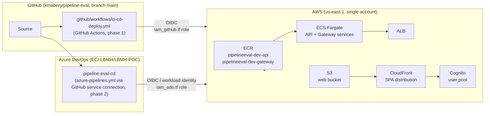

# Architecture — pipeline-eval

`pipeline-eval` ships the same workload through **two competing CI/CD vendors** (GitHub Actions in phase 1; Azure DevOps in phase 2). Both vendors deploy to the **same AWS account** using the **same Terraform-managed stack**, so any drift in this directory or [`../../iac/terraform/`](../../iac/terraform/) affects both phases identically. The pipeline comparison is the variable; the runtime is the constant.

## Components (managed in [`../../iac/terraform/`](../../iac/terraform/))

| Component | Terraform file (illustrative) | Purpose |
|-----------|-------------------------------|---------|
| **VPC + subnets** | `vpc.tf` | Network for ECS tasks and ALB |
| **ECR repos** | `ecr.tf` | `pipelineeval-dev-api`, `pipelineeval-dev-gateway` |
| **ECS Fargate cluster + services** | `ecs.tf` | API + Gateway runtime |
| **ALB** | `alb.tf` | Public HTTPS entry to API |
| **S3 web bucket** | `s3_web.tf` | SPA bundle |
| **CloudFront distribution** | `cloudfront.tf` | SPA edge + cache |
| **Cognito user pool + client** | `cognito.tf` | Auth |
| **GitHub Actions OIDC role** | `iam_github.tf` | `pipelineeval-dev-github-actions` — phase 1 deploys |
| **Azure DevOps OIDC role** | `iam_ado.tf` | `pipelineeval-dev-ado` — phase 2 deploys |
| **SSM parameters (YARP)** | `ssm.tf` (if applicable) | Runtime gateway routing config |

## Pipeline-vs-runtime separation

- **Pipeline (variable)** — what differs between phases:
  - Trigger surface (GitHub Actions vs Azure DevOps).
  - Approval gate (GitHub Environment vs ADO Environment check).
  - Package feed (GitHub Packages vs Azure Artifacts).
  - Webhook surface (GitHub repo hooks vs ADO service hooks).
- **Runtime (constant)** — same regardless of vendor:
  - Same ECR images.
  - Same ECS service revisions (one new task definition per deploy).
  - Same CloudFront distribution / S3 bucket.
  - Same Cognito user pool.

## Drift validation

After **green** CI in either phase, the AWS Solution Architect runs a **read-only AWS CLI** drift check against this directory and `iac/terraform/` per [`../.cursor/agents/aws-solution-architect.md`](../.cursor/agents/aws-solution-architect.md). Failed drift without remediation is **not** phase closure.

## Cross-references

- IaC source: [`../../iac/terraform/`](../../iac/terraform/) (current modules; outputs in `outputs.tf`)
- DevOps GHA operator: [`../.cursor/agents/devops-github-actions-operator.md`](../.cursor/agents/devops-github-actions-operator.md)
- DevOps ADO operator: [`../.cursor/agents/devops-pipeline-operator.md`](../.cursor/agents/devops-pipeline-operator.md)
- Phase plan: [`../phase-plan.md`](../phase-plan.md)
