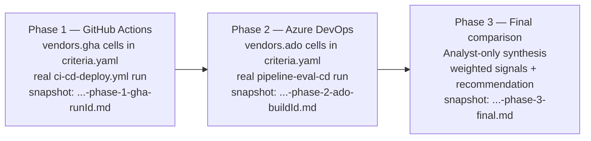

# Pipeline evaluation phase plan — GitHub Actions vs Azure DevOps

This program compares **GitHub Actions** (`ci-cd-deploy.yml`) against **Azure DevOps** (`pipeline-eval-cd` in `https://dev.azure.com/ECI-LBMH/LBMH-POC`) for the `pipeline-eval` workload, building and deploying the **same code** to the **same AWS account** through each vendor.

Each vendor phase runs a **full delivery cycle** (CI → Deploy with `production` approval → deployed smoke) and produces a dated archived snapshot under [`docs/evaluation-reports/`](evaluation-reports/) plus a structured sidecar under [`docs/phase-evidence/`](phase-evidence/).

## Phases

| Phase | Vendor | Launcher | DevOps subagent | Pipeline | Snapshot pattern |
|-------|--------|----------|-----------------|----------|------------------|
| **1** | GitHub Actions | [`.cursor/plans/phases/phase-1-gha.md`](../.cursor/plans/phases/phase-1-gha.md) | `/devops-github-actions-operator` | `.github/workflows/ci-cd-deploy.yml` on `main` | `evaluation-report-MM-dd-yyyy-HHmmss-phase-1-gha-<runId>.md` |
| **2** | Azure DevOps | [`.cursor/plans/phases/phase-2-ado.md`](../.cursor/plans/phases/phase-2-ado.md) | `/devops-pipeline-operator` | `pipeline-eval-cd` in `ECI-LBMH/LBMH-POC` (defined by `azure-pipelines.yml`) | `evaluation-report-MM-dd-yyyy-HHmmss-phase-2-ado-<buildId>.md` |
| **3** | Final matrix | [`.cursor/plans/phases/phase-3-final-matrix.md`](../.cursor/plans/phases/phase-3-final-matrix.md) | Analyst-only | n/a | `evaluation-report-MM-dd-yyyy-HHmmss-phase-3-final.md` |

## Vendor lock per phase

Per [`.cursor/rules/pipeline-vendor-phase.mdc`](../.cursor/rules/pipeline-vendor-phase.mdc):

| Phase | SDET may edit in `criteria.yaml` |
|-------|---------------------------------|
| 1 | `vendors.gha.*` only |
| 2 | `vendors.ado.*` only |
| 3 | **No vendor-cell edits** — Analyst computes weighted signals, gap list, recommendation |

## Scoring rubric (phase 3)

`signal = sum(weight * score) / 100`, where:

| Rating | Score |
|--------|-------|
| `pass` | 1.0 |
| `caveat` | 0.5 |
| `fail` | 0.0 |
| `tbd` | 0 |

Sensitivity check (mandatory): recompute weighted signals with `caveat=0.25` and `caveat=0.75`; report whether the ranking is stable.

## Decision matrix (rendered)

The following block is regenerated by `node scripts/render-decision-matrix.mjs --target phase-plan`. **Do not hand-edit between the markers.**

<!-- matrix:begin -->
| Criterion | Weight | Why it matters | GitHub Actions | Azure DevOps |
|---|---|---|---|---|
| `approval` | 40 | Required in workflows | tbd | tbd |
| `package` | 40 | npm and NuGet are required artifacts | tbd | tbd |
| `webhook` | 20 | monitoring success of pipelines | tbd | tbd |
<!-- matrix:end -->

## Evidence files

- Decision matrix source of truth: [`decision-matrix/criteria.yaml`](decision-matrix/criteria.yaml)
- Authoring guide: [`decision-matrix/README.md`](decision-matrix/README.md)
- Per-criterion evidence pointers: [`decision-matrix/evidence-guide.md`](decision-matrix/evidence-guide.md)
- Phase sidecar JSON: [`phase-evidence/`](phase-evidence/) (one file per phase run; replaced on rerun)
- Archived narrative snapshots: [`evaluation-reports/`](evaluation-reports/)
- Index + latest snapshot pointer: [`evaluation-report.md`](evaluation-report.md)
- Architecture: [`architecture/README.md`](architecture/README.md)

## Closure gates

Closure language is governed by [`.cursor/rules/phase-closure-gate.mdc`](../.cursor/rules/phase-closure-gate.mdc) and [`.cursor/rules/phase-gate-outcomes.mdc`](../.cursor/rules/phase-gate-outcomes.mdc). A vendor phase **cannot** record `phaseGateOutcome: passed` without a non-empty HTTPS `evidenceLinks.pipelineRunUrl` for that vendor's pipeline.
