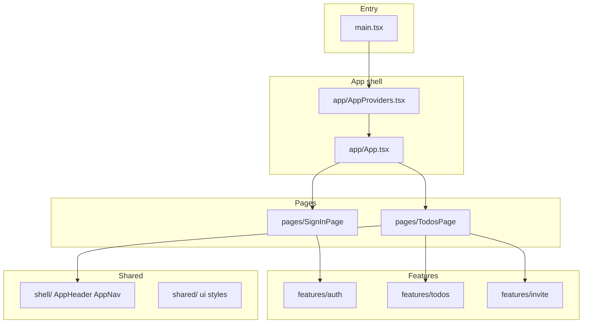

# PipelineEval Web

Vite + React 19 + TypeScript SPA for the todo list with optional cat-photo attachments, Cognito sign-in, and a Fluent UI v9 experience. For repo-wide architecture and phases, see the [repository root README](../../../README.md).

## Tech stack and design system

| Area | Details |
|------|--------|
| **Build** | [Vite](https://vitejs.dev/) 8, TypeScript |
| **UI (Fluent v9)** | [`@fluentui/react-components`](https://react.fluentui.dev/) and [`@fluentui/react-nav`](https://www.npmjs.com/package/@fluentui/react-nav) — `FluentProvider`, tokens, and primitives. [`FluentThemeRoot.tsx`](src/FluentThemeRoot.tsx) wraps the app and picks **web light** or **web dark** from `prefers-color-scheme`. |
| **Composition** | [`AppProviders`](src/app/AppProviders.tsx) — `FluentThemeRoot` + [`AuthContext`](src/features/auth/AuthContext.tsx). [`App.tsx`](src/app/App.tsx) only switches between sign-in and the todos page based on auth. |
| **Auth** | [Amazon Cognito](https://docs.aws.amazon.com/cognito/) via `amazon-cognito-identity-js` (pool config from `VITE_*` env — see below). |
| **RUM (optional)** | [Coralogix](https://coralogix.com/) browser SDK; initialized in [`coralogixRum.ts`](src/coralogixRum.ts) from [`main.tsx`](src/main.tsx) when env keys are set. |
| **Styling** | Global reset/layout in [`index.css`](src/index.css); app layout and utilities in [`shared/styles/app.css`](src/shared/styles/app.css). Use Fluent components first; add CSS for layout and one-off polish. |

## How the `src/` tree is organized

| Path | Role |
|------|------|
| `src/app/` | `App` (auth gate and page switch), `AppProviders`. |
| `src/pages/` | Top-level screens: `SignInPage`, `TodosPage`. |
| `src/shell/` | App chrome: `AppHeader`, `AppNav`. |
| `src/features/auth/` | Cognito wiring, `AuthContext`, `AuthScreen`, `authToken`. |
| `src/features/todos/` | REST client (`api.ts`), `useTodos` and upload hooks, `TodoList` / `TodoItem` / `NewTaskDialog`. |
| `src/features/invite/` | Invite flow hook and `InviteDialog`. |
| `src/shared/` | Reusable `ui` (e.g. `ErrorBanner`) and `styles`. |

**Tests:** `tests/unit` and `tests/integration` (Vitest), `tests/e2e` (Playwright), `cypress/` (component tests).

## npm scripts

| Command | Purpose |
|--------|--------|
| `npm run dev` | Vite dev server (HMR). |
| `npm run build` | `tsc -b` + production Vite build to `dist/`. |
| `npm run preview` | Preview the production build locally. |
| `npm run lint` | ESLint on the project. |
| `npm test` / `npm run test:unit` / `test:integration` | Vitest suites. |
| `npm run test:e2e` | Playwright (all projects). |
| `npm run test:e2e:local` / `test:e2e:deployed` | Playwright filtered by project. |
| `npm run test:ct` / `test:ct:open` | Cypress component tests. |

## Environment variables

Copy [`.env.example`](.env.example) to `.env.local`. Values are public SPA config only—never commit secrets.

- **Vite / app:** `VITE_API_URL`, `VITE_COGNITO_*` (pool, client, region) — see comments in `.env.example`. Local **ports** for the dev server and API proxy follow the **repository root** `.env` (`LOCAL_WEB_PORT`, `LOCAL_API_PORT`); see root `/.env.example`.
- **Playwright (deployed E2E):** `E2E_TEST_EMAIL`, `E2E_TEST_PASSWORD`, `E2E_BASE_URL` — read by `playwright.config.ts` and specs under `tests/e2e`.

## See also

- [Vite + React + TypeScript](https://vitejs.dev/guide/) — template-level tooling (HMR, env handling) when you need upstream detail beyond this README.
